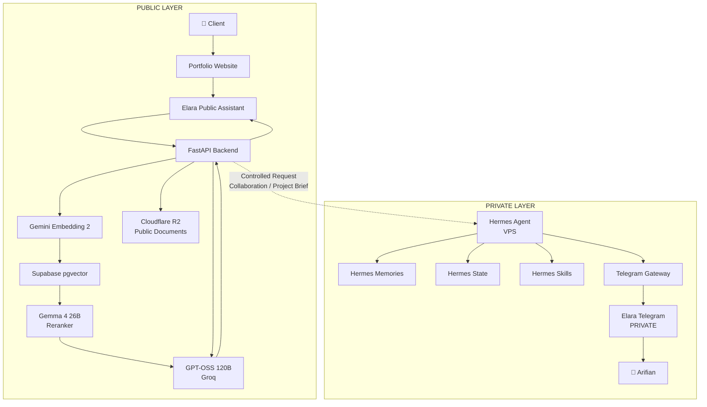
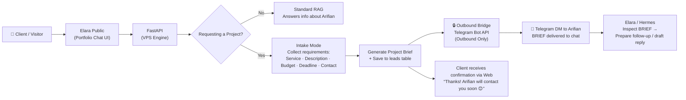
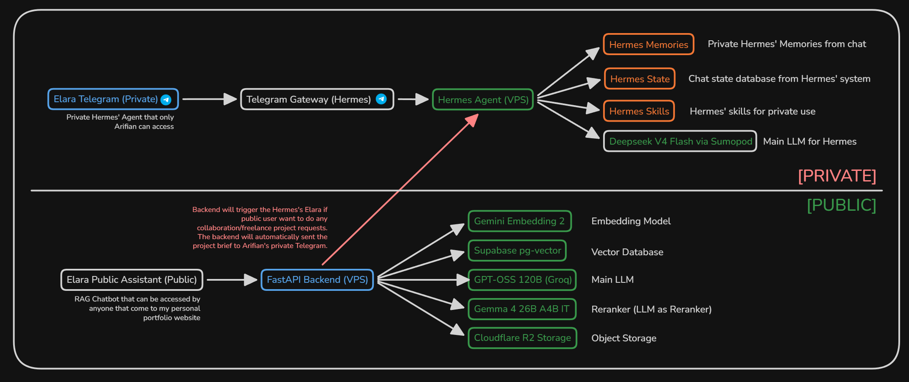

# Elara

## Arifian's AI Personal Assistant (formerly known as Arifian.AI v2)

> **Elara v1 (Public)** — Elara is powered by the evolution of Arifian.AI, which originally answered public questions about Arifian. Today, Elara operates as his autonomous AI personal assistant. She engages visitors naturally and can deliver structured "Project Briefs" directly to Arifian's personal chat right from the [https://arifian.dev](https://arifian.dev) chat interface! Arifian reviews incoming briefs and follows up promptly on projects aligned with his engineering stack.

---

## 🌟 Architecture & Tech Stack

### 1. Public vs Private Layer Architecture



---

### 2. RAG Flow vs Project Request Intake Brief Fallback



---

### 3. Component Stack Summary
- **Core Backend Engine:** FastAPI (Python 3.11+ managed via `uv`)
- **Text Generation & Query Rewriting:** Groq API (`openai/gpt-oss-120b`)
- **High-Density Vector Embeddings:** Google AI Studio (`gemini-embedding-2`, 768 dimensions)
- **LLM-as-Reranker:** Google AI Studio (`gemma-4-26b-a4b-it`)
- **Vector Database:** Supabase PostgreSQL with `pgvector 0.8.2`, HNSW Cosine index & Full-Text Search (FTS GIN)
- **Object Storage:** Cloudflare R2 (`boto3` S3 client)
- **Security & Authentication:** JWT Bearer tokens + `X-Admin-Token` header with PBKDF2 SHA-256 password hashing
- **Admin GUI Interface:** Built-in Single Page Application (Minimalist Brutalism aesthetic) served directly at **`GET /`**

---

## ✨ Core Features & System Modules

### 1. Hybrid RAG Pipeline (`POST /chat`)
- **Query Rewriting:** Resolves pronouns and contextual conversation history using Groq before performing vector lookups.
- **Hybrid Search:** Fuses dense vector cosine similarity (`vector(768)`) with Full-Text Search (FTS GIN) via **Reciprocal Rank Fusion (RRF)**.
- **Similarity Threshold Guard:** Top-1 cosine similarity `< 0.6` bypasses heavy LLM reranking and returns polite persona responses.
- **Conversational Small-Talk Handler:** Smart detection for common greetings (`hi`, `hello`, `good morning`, `who are you`, `how are you`, `thanks`), enabling Elara to respond warmly in character without misclassifying queries as Knowledge Base failures.
- **SSE Streaming:** Real-time character-by-character response streaming for web clients.

### 2. Project Request Intake Assistant & Real-Time Telegram Alerts
- **6-Step Conversational State Machine:** Guides visitors through structured project intake (Service, Description, Budget, Target Deadline, Contact Info, and Confirmation).
- **Automated Lead Persistence:** Brief details are saved directly into the `leads` table in Supabase.
- **Outbound Real-Time Telegram Alerts:** Whenever a new **Project Request Lead** or **Anonymous Message (Confession)** is submitted, the backend formats an HTML notification and sends an instant alert to **Arifian's Personal Telegram Chat / Elara Hermes Gateway** via Telegram Bot API `sendMessage`.

### 3. Integrated Admin Dashboard Console (`GET /`)
Accessible directly in the browser at [http://localhost:8000/](http://localhost:8000/) featuring a Minimalist Brutalism interface:
- **JWT Auth & User Management:** Password hashing, `admin_users` table management, password change forms, and new admin registration.
- **Interactive Chat Playground:** Live testing widget to chat with Elara, inspect streaming output, and examine retrieved RAG sources.
- **Knowledge Base Management:** Inspect all ingested documents, view text chunks, ingest raw text directly, and delete documents with cascade chunk cleanup.
- **GitHub Repository Ingestion:** Scrapes READMEs, dependency manifests (`package.json`/`pyproject.toml`), directory structures, and repository metadata via GitHub API.
- **Document File Upload:** Ingests PDF (text-based), DOCX, CSV, MD, and TXT files, preserving raw files in Cloudflare R2.
- **Anonymous Confessions:** View portfolio `/message` submissions with local timestamps, publish public replies, or delete entries.
- **Dynamic System Prompt Manager:** Create, activate, or deactivate custom persona system prompts for Elara.
- **LLM Connections Latency Tester:** Real-time latency measurements (ping ms) and connection health status for Groq, Gemini Embeddings, and Gemma Reranker.
- **Infrastructure System Health Monitoring:** Live status monitoring for Supabase DB, R2 Storage, and Telegram Bridge.

### 4. Bidirectional Hermes Telegram Agent Integration (`scripts/elara_admin_skill.py`)
Elara operates with a dual-agent model bridging public web interactions with Arifian's private autonomous agent infrastructure:

- **Inside the Private Hermes Agent**: Elara's Telegram bot (`autumn_elara_nymph_bot`) runs natively inside a persistent **Hermes Agent framework** hosted on Arifian's VPS. The Hermes agent maintains long-term memory, state management, and custom skill execution.
- **Outbound Real-Time Web-to-Telegram Bridge (`services/bridge.py`)**: When a public web user completes a project request brief or posts an anonymous confession on [https://arifian.dev](https://arifian.dev), the FastAPI engine formats an HTML notification payload and dispatches it directly into Arifian's private Telegram chat via Telegram Bot API `sendMessage`.
- **Inbound Hermes Admin Skill (`scripts/elara_admin_skill.py`)**: Inside Telegram, Arifian interacts with Hermes/Elara using natural language or slash commands. The `elara-admin` skill allows Hermes to securely query and update the public FastAPI backend over `localhost`:
  - `/leads` or *"any new leads?"* / *"ada leads tuh?"* → Lists all incoming project request proposals.
  - `/lead <id>` → Displays the full structured brief (service, budget, deadline, contact).
  - `/status <id> <contacted|won|lost>` → Updates lead status in Supabase.
  - `/stats` → Displays system metrics and knowledge base document counts.
- **Webhook-Free Architecture Safety**: Because the Telegram Bot operates inside Hermes using `getUpdates` (long-polling) on the VPS, the public backend does **not** attach a webhook. This design completely eliminates `HTTP 409 Conflict` errors and guarantees 100% operational uptime for both public web visitors and private Telegram management.




---

## 🚀 Quick Start & Installation

### 1. Prerequisites
Ensure `uv` (Python package manager) is installed:
```bash
# Windows (PowerShell)
powershell -ExecutionPolicy ByPass -c "irm https://astral.sh/uv/install.ps1 | iex"
```

### 2. Environment Configuration (.env)
Copy the environment template:
```bash
cd elara-public
cp .env.example .env
```
Fill in required credentials in `.env`:
- `SUPABASE_DB_URL`: Postgres pooler connection string.
- `GROQ_API_KEY`: Groq API Key.
- `GEMINI_API_KEY`: Google AI Studio API Key.
- `R2_ACCESS_KEY_ID` & `R2_SECRET_ACCESS_KEY`: Cloudflare R2 credentials.
- `ADMIN_TOKEN`: Secure admin access token.

### 3. Database Migration & Initial Seeding
Run automated migration to create database tables (`documents`, `chunks`, `leads`, `intake_sessions`, `confessions`, `system_prompts`, `admin_users`), seed the admin user, and seed initial Knowledge Base context:
```bash
# 1. Run database table DDL migration to Supabase
uv run python scripts/run_migration.py

# 2. Seed initial admin user account (uses ADMIN_TOKEN from .env)
uv run python scripts/seed_admin.py

# 3. Seed initial profile & services Knowledge Base document to pgvector
uv run python scripts/seed_kb.py
```

### 4. Running the Backend Server
Start the Uvicorn development server:
```bash
uv run uvicorn app:app --port 8000 --reload
```

Open your browser:
- **Admin Dashboard Console:** [http://localhost:8000/](http://localhost:8000/)
  - **Default Username:** `admin`
  - **Default Password:** Set from `ADMIN_TOKEN` value in `.env`
- **Interactive Swagger API Docs:** [http://localhost:8000/docs](http://localhost:8000/docs) *(disabled automatically in production)*

---

## 🧪 Running Automated Tests

Run the complete pytest suite (8/8 test modules covering ingestion, retrieval thresholding, intake state machine, confessions, and system prompts):
```bash
uv run pytest tests/ -v -s
```

---

## 📁 Project Directory Structure

```
elara-public/
├── app.py                     # FastAPI application entry point & root GET / route
├── config.py                  # Environment settings & asyncpg connection pool
├── models.py                  # Pydantic schemas for API requests & responses
├── pyproject.toml             # Project dependency configuration (managed by uv)
├── uv.lock                    # Dependency lockfile
├── README.md                  # Comprehensive project documentation
├── LICENSE                    # MIT License file
├── .env.example               # Environment variables template
├── routers/                   # FastAPI route endpoints
│   ├── admin.py               # Admin GUI Console & management endpoints
│   ├── chat.py                # Public Chat RAG endpoints
│   ├── confessions.py         # Anonymous messages / confessions endpoints
│   ├── health.py              # Health check endpoints
│   └── system_prompts.py      # Dynamic system prompt manager endpoints
├── services/                  # Business logic & AI pipelines
│   ├── auth.py                # JWT authentication & password hashing helper
│   ├── bridge.py              # Outbound Telegram notification bridge
│   ├── generate.py            # Groq text generation & dynamic system prompts
│   ├── ingest.py              # File document ingestion pipeline (PDF/DOCX/CSV/MD/TXT)
│   ├── intake.py              # Project request intake state machine
│   ├── rag.py                 # RAG pipeline orchestrator
│   ├── repo_ingest.py         # GitHub repository ingestion pipeline
│   ├── rerank.py              # Gemma LLM-as-reranker service
│   ├── retrieval.py           # Gemini embedding & pgvector hybrid retrieval
│   └── rewrite.py             # Groq query rewriting service
├── static/
│   ├── admin.html             # Single Page Admin Console (Minimalist Brutalism)
│   └── components_fallback.png # Visual diagram of RAG & intake component flow
├── scripts/                   # Utility & CLI scripts
│   ├── elara_admin_skill.py   # Hermes Telegram CLI skill bridge
│   ├── run_migration.py       # Supabase database table migration script
│   ├── seed_admin.py          # Default admin user seeding script
│   ├── seed_kb.py             # Knowledge Base initial document seeder
│   └── verify_migration.py   # Database migration schema verifier
├── supabase/
│   └── migrations.sql         # SQL DDL migration statements for Supabase Postgres
├── utils/                     # Document parsers, text chunker, and R2 S3 client
└── tests/                     # Automated pytest test suite
```

---

## 🔒 Production Security Best Practices

When deploying to a production VPS environment (`ENVIRONMENT=production`):
1. Interactive Swagger docs (`/docs`, `/redoc`, `/openapi.json`) are disabled automatically (HTTP 404).
2. Set a strong `ADMIN_TOKEN` and update the admin user password inside the Admin Console.
3. Ensure `.env` is kept private and listed inside `.gitignore`.

---

## 📜 License
This project is licensed under the **[MIT License](LICENSE)** — Copyright © 2026 [Arifian Saputra](https://arifian.dev).
You are free to use, modify, and inspect this repository.
